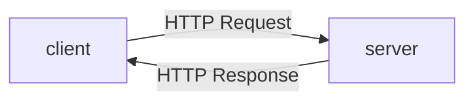
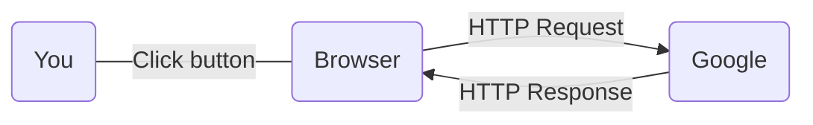
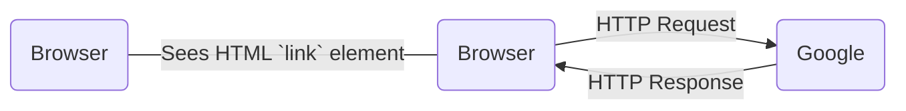
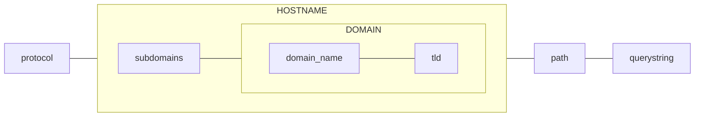
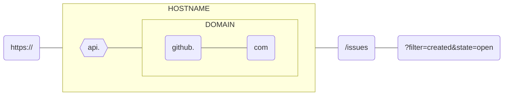
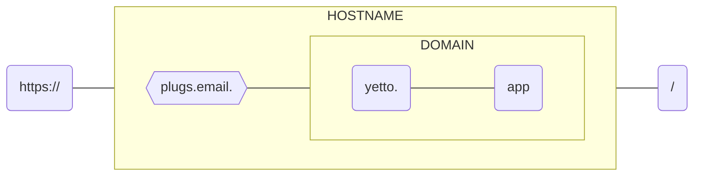

# APIceberg ahead

---


**Nick Cannariato** (aka. **@birdcar**)

Co-founder @ Yetto

---
layout: default
---

## Places I've supported

<div class="py-24 sm:py-24">
  <div class="mx-auto max-w-7xl px-6 lg:px-8">
    <div class="-mx-6 grid grid-cols-2 gap-0.5 overflow-hidden sm:mx-0 sm:rounded-2xl md:grid-cols-3">
      <div class="bg-zinc-600/5 p-8 sm:p-10">
        
      </div>
      <div class="bg-zinc-600/5 p-6 sm:p-10">
        
      </div>
      <div class="bg-zinc-600/5 p-6 sm:p-10">
        
      </div>
      <div class="bg-zinc-600/5 p-6 sm:p-10">
        
      </div>
      <div class="bg-zinc-600/5 p-6 sm:p-10">
        
      </div>
      <div class="bg-zinc-600/5 p-6 sm:p-10">
        
      </div>
    </div>
  </div>
</div>

<style>
  h2 {
    text-align: center;
  }
</style>

---

## Goals

1. A quick review of HTTP, URLs, and APIs
2. An understanding of HTTP API Authentication strategies in tools you use every day
3. Experience thinking about, breaking, and fixing HTTP requests to an API
4. (if we have time) building a custom action using a tool like Zapier

---
layout: iframe
url: https://www.youtube-nocookie.com/embed/Eqpt_Hnx8H4?si=_IvuEkSYqRX2xdfT
---
<!-- Purposefully empty since the above layout handles itself -->
---

## Time Out: Some pre work

1. Go to the HTTPie App: https://httpie.io/app (optionally, log in with a GitHub Account)
2. **Visit this page and copy the token:** https://gist.github.com/birdcar/8676df501d8db609af24f17ec8c36ebb
3.

---
layout: section
---

## Review


---

## HTTP

HyperText Transfer Protocol

---

### HTTP: When does it happen?

<br />
<br />


---

### HTTP: When does it happen?

<br />
<br />



---

### HTTP: When does it happen?

<br />
<br />



---

## HTTP: The Cycle

- Request
  - Comes from a "client" (e.g. your web browser, a CLI, Postman, HTTPie, your SaaS app)
  - Communicates with "verbs", URLs, headers, and payload/body
- Response
  - Comes from a "server" (e.g. A different SaaS app, any that knows how to respond to HTTP requests)
  - Communicates with response codes, headers, and payload/body

---
layout: full
---

## Anatomy of a URL

<br />
<br />
<br />
<br />



---
layout: full
---

## Anatomy of a URL

<br />
<br />
<br />
<br />



---
layout: full
---

## Anatomy of a URL

<br />
<br />
<br />
<br />


---

## Anatomy of HTTP Verbs

- `GET`: I'm looking for something and would like you to give it to me
- `POST`: Here's something I want you to make from scratch
- `PUT/PATCH`: You already know what this is, but please update it for me
- `DELETE`: Lol nuke it from space
- `HEAD`: Make a `GET` request but ask only for the headers

---

## HTTP Status Code Organization

- `100-199`: **Informational**: "I'm not done doing the thing yet"
- `200-299`: **Successful**: "I did that thing you asked me to do"
- `300-399`: **Redirection**: "I think know what you're looking for, but it's not here it's over there"
- `400-499`: **Client Error**: "You're either asking for something that doesn't exist or sending me bad info"
- `500-599`: **Server Error**: "Something broke on my end when I tried to do that"

---
layout: full
---

```http{all|5|1|2|6}
GET / HTTP/1.1
Accept: */*
Accept-Encoding: gzip, deflate
Connection: keep-alive
Host: apiceberg.birdcar.dev
User-Agent: HTTPie/3.2.2

```

---
layout: full
---

```http{all|1-10|1|5|12-27|all}
HTTP/1.1 200 OK
Age: 0
Cache-Control: public, max-age=0, must-revalidate
Content-Length: 531
Content-Type: text/html; charset=UTF-8
Date: Sun, 08 Oct 2023 16:02:20 GMT
Etag: "a5fdd42b717b530e6175ab91f67037f5-ssl"
Server: Netlify
Strict-Transport-Security: max-age=31536000
X-Nf-Request-Id: 01GVGTV1G1J5K7JE2BGAP4Q91R

<!DOCTYPE html>
<html lang="en">
<head>
  <meta charset="UTF-8">
  <meta name="viewport" content="width=device-width, initial-scale=1.0">
  <link rel="icon" href="/assets/8b9eb19119592679c97707c257d88026-a02f38e2.png">
<link rel="stylesheet" href="https://fonts.googleapis.com/css2?family=Fira+Code:wght@200;400;600&display=swap" type="text/css">
  <script type="module" crossorigin src="/assets/index-cf09b09f.js"></script>
  <link rel="stylesheet" href="/assets/index-9b901fa7.css">
</head>
<body>
  <div id="app"></div>


</body>
</html>
```

---
layout: section
---

## Ok, *now* let's talk about Authentication

---

# Why is Authentication complicated?

---

## Authorization vs. Authentication

- *Authentication*: You are a specific person
- *Authorization*: You have permission to do a specific thing

---

## Types of Authentication

- Basic
- Bearer
- OAuth 2.0

---

## HTTP Basic Authentication

- Pros
  - Simple
  - Built in to your HTTP Client
- Cons
  - Uses your actual username and password ❌ 🚨
  - Leverages Base64 encoding 🙈🤮
  - Fundamentally insecure in general
  - _Completely_ insecure over HTTP
  - _Marginally_ secure over HTTPS

---

## Example: Basic authentication

---

## Bearer Token Authentication

- Pros
  - Uses a token generated by the application
  - *Potentially* able to have limited authorization (e.g. permissions/scopes)
  - *Generally* allows for multiple tokens to be used for specific purposes
- Cons
  - Long-lived token
  - Passes the token value in the headers (same flaws as Basic Authentication)
  - More secure than basic auth, but requires you to take maintenance, auditing, and security seriously

---

## Example: Bearer token authentication

---

## OAuth 2.0

- Pros
  - Way more secure ✅ 😍
  - Native support for limited authorization via scopes
  - Explicit co-operation between
- Cons
  - Complicated as hell 😵‍💫
  - Supports than one flow, not always available in the way you need

---

## Example: OAuth Authentication (client flow)

---

## Demonstration: Oauth Authentication (auth code flow)

---

---

## Planning for failure: Debugging in the real world

---

## Making your own roads: Using Zapier or Retool
